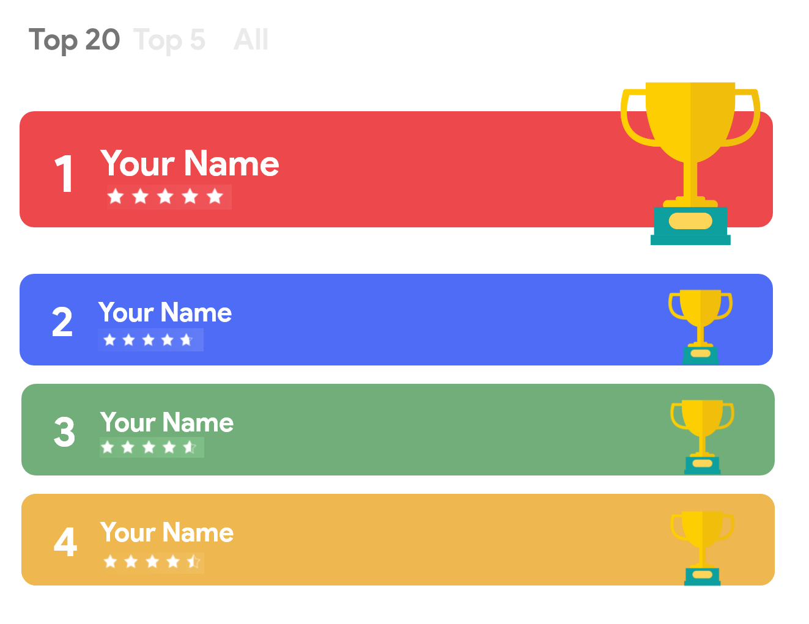

### DSC CIET
#### #30DaysOfCloud Leaderboard 

This is the frontend project that uses a JSON API to fetch results for student's progress and display them on the web.

#### Live at
<pre>
The link for the live demo will be shared here.
</pre>

#### Structure

The project follows very simplistic strucutre, all the assets (images, videos, styles etc.) should be stored in separate folders inside the parent 'assets' directory.

<pre>

└───assets
    ├───images
    └───styles
</pre>

##### Made with ♥ by DSC Team

